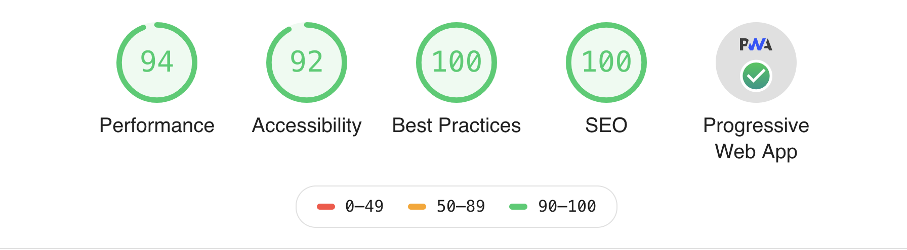

# Gatsby Starter: Boudhayan

> A portfolio starter for Gatsby integrated with Contentful CMS.

The target audience are developers 💻 and tech writers ✍️.

###  [Website Link](https://boudhayan.github.io/)

## Features 🛠

- [Gatsby v2](https://www.gatsbyjs.org/)
- [Rebass 3.0 🎉](https://rebassjs.org/): styled component system
- [React Reveal](https://www.react-reveal.com/)
- Dynamic content from [Contentful](https://contentful.com)
- Offline support
- PWA ready
- SEO
- Responsive design
- Icons from [font-awesome](https://fontawesome.com/)
- [Netlify](https://www.netlify.com) Deployment Friendly
- Medium integration
- Social sharing (Twitter, Facebook, Google, LinkedIn)
- Developer tools:
  - `eslint`
  - `prettier`
- Google Analytics

### Lighthouse Score 💯

